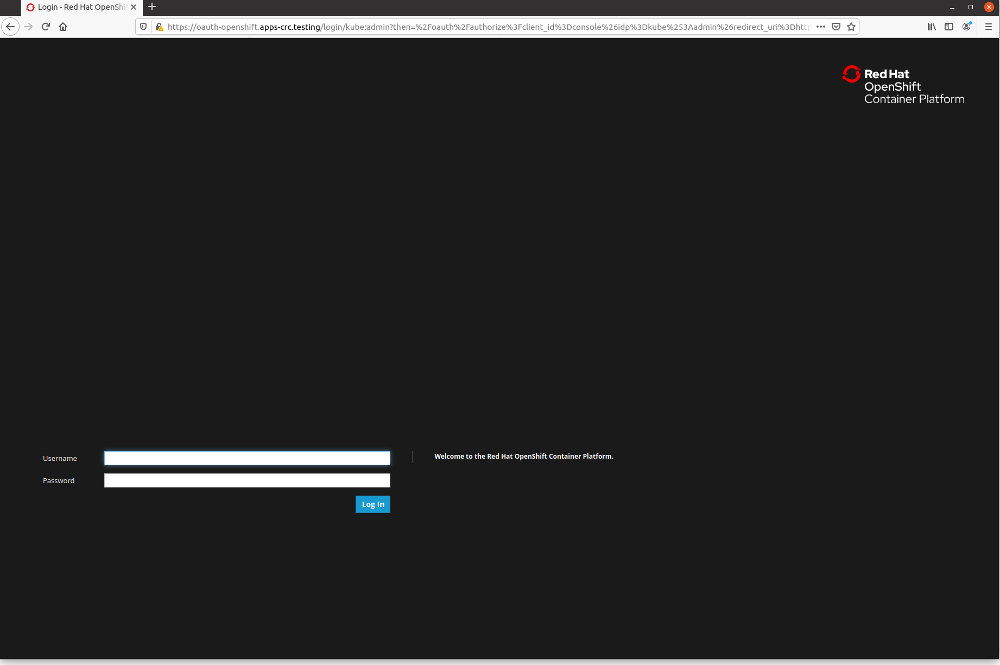

#Pre-requisits:

Install `libvirt` and `NetworkManager` packages for ubuntu 


- This can be achieved by running the following command:

```
sudo apt install qemu-kvm libvirt-daemon libvirt-daemon-system network-manager)=

```


- install Docker.io for ubuntu This can be achieved by running the following commands:

```

 sudo apt install docker.io
 sudo apt-get remove docker docker-engine docker.io

 sudo apt install docker.io

 sudo systemctl start docker

 sudo systemctl enable docker

```
- Step 1. Login to cloud.redhat.com at the time of writing this article its on 

Choice `create cluster` - Openshift Container Platform 4- Run on local laptop option.

Download the CRC for Linux in this case because we are on Ubuntu.


 Download the CDK from cloud.redhat.com at the time of writing this article its on `OpenShift 4.3.10`

- Step 2. https://cloud.redhat.com/openshift/install/crc/installer-provisioned


Once you have the crc downloaded extract the files and place your binary shells path 
```

e.g '/usr/bin/'.

````

- Step 3. Once install run the following

```

 crc start
WARN A new version (1.16.0) has been published on https://cloud.redhat.com/openshift/install/crc/installer-provisioned 
INFO Checking if oc binary is cached              
INFO Checking if podman remote binary is cached   
INFO Checking if running as non-root              
INFO Checking if Virtualization is enabled        
INFO Checking if KVM is enabled                   
INFO Checking if libvirt is installed             
INFO Checking if user is part of libvirt group    
WARN Skipping above check ...                     
INFO Checking if libvirt is enabled               
INFO Checking if libvirt daemon is running        
INFO Checking if a supported libvirt version is installed 
INFO Checking if crc-driver-libvirt is installed  
INFO Checking if libvirt 'crc' network is available 
INFO Checking if libvirt 'crc' network is active  
INFO Checking if NetworkManager is installed      
WARN Skipping above check ...                     
INFO Checking if NetworkManager service is running 
WARN Skipping above check ...                     
INFO Checking if /etc/NetworkManager/conf.d/crc-nm-dnsmasq.conf exists 
WARN Skipping above check ...                     
INFO Checking if /etc/NetworkManager/dnsmasq.d/crc.conf exists 
WARN Skipping above check ...                     
INFO Starting CodeReady Containers VM for OpenShift 4.3.10... 
INFO Verifying validity of the cluster certificates ... 
INFO Check internal and public DNS query ...      
INFO Check DNS query from host ...                
INFO Cluster TLS certificates have expired, renewing them... [will take up to 5 minutes] 
INFO Starting OpenShift cluster ... [waiting 3m]  
INFO                                              
INFO To access the cluster, first set up your environment by following 'crc oc-env' instructions 
INFO Then you can access it by running 'oc login -u developer -p developer https://api.crc.testing:6443' 
INFO To login as an admin, run 'oc login -u kubeadmin -p KubeadminPassword https://api.crc.testing:6443' 

INFO You can now run 'crc console' and use these credentials to access the OpenShift web console 
Started the OpenShift cluster
WARN The cluster might report a degraded or error state. This is expected since several operators have been disabled to lower the resource usage. For more information, please consult the documentation 


```
- Step 4. Type `crc start` and login with your `Red Hat` developer account.

```

 crc start
WARN A new version (1.16.0) has been published on https://cloud.redhat.com/openshift/install/crc/installer-provisioned 
INFO Checking if oc binary is cached              
INFO Checking if podman remote binary is cached   
INFO Checking if running as non-root              
INFO Checking if Virtualization is enabled        
INFO Checking if KVM is enabled                   
INFO Checking if libvirt is installed             
INFO Checking if user is part of libvirt group    
WARN Skipping above check ...                     
INFO Checking if libvirt is enabled               
INFO Checking if libvirt daemon is running        
INFO Checking if a supported libvirt version is installed 
INFO Checking if crc-driver-libvirt is installed  
INFO Checking if libvirt 'crc' network is available 
INFO Checking if libvirt 'crc' network is active  
INFO Checking if NetworkManager is installed      
WARN Skipping above check ...                     
INFO Checking if NetworkManager service is running 
WARN Skipping above check ...                     
INFO Checking if /etc/NetworkManager/conf.d/crc-nm-dnsmasq.conf exists 
WARN Skipping above check ...                     
INFO Checking if /etc/NetworkManager/dnsmasq.d/crc.conf exists 
WARN Skipping above check ...                     
INFO Starting CodeReady Containers VM for OpenShift 4.3.10... 
INFO Verifying validity of the cluster certificates ... 
INFO Check internal and public DNS query ...      
INFO Check DNS query from host ...                
INFO Cluster TLS certificates have expired, renewing them... [will take up to 5 minutes] 

```

- Step 5. Finally run the `crc console` to luanch the Openshift console, your credentials to login will by printed  out from the following command line output above. Hey Vola! your can now login to your codeready continer Openshift cluster.

